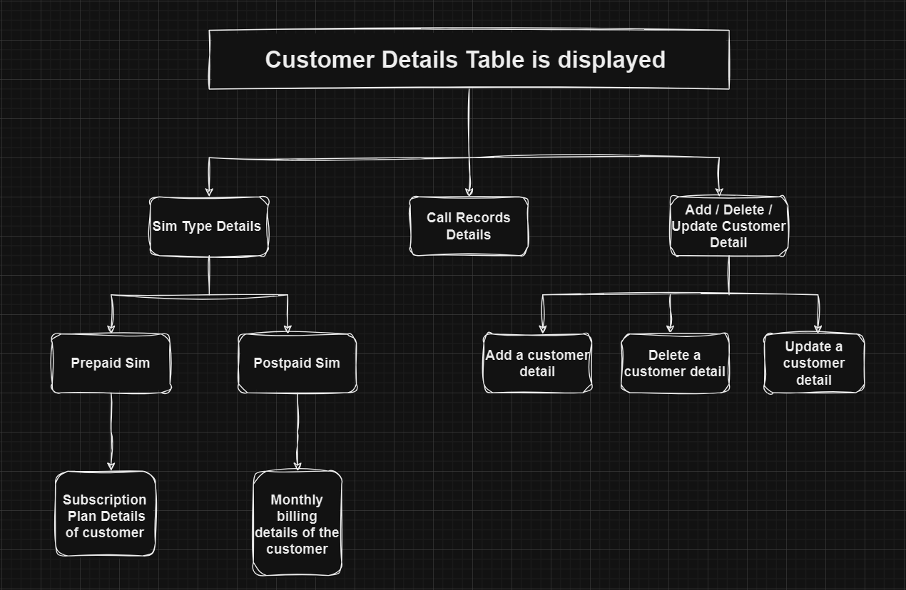

# Telecommunication-DBMS

In this project I developed a database management system of a telecommuncation company by storing it's data into MySQL database and manupilating the data using python.

Here is a flowchart for better understanding about the project:

Initially customer details table is printed than a menu card is displayed with options to either check for details regarding sim card holder or to make changes into the data stored in the database by just entering the values asked by the program by refering to the repective tables shown on the respective paths chosen .
 
